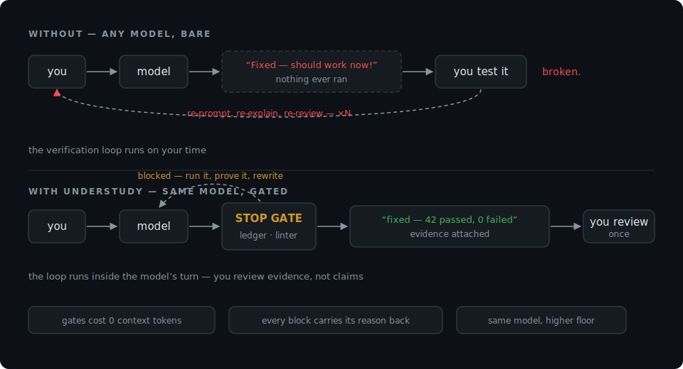

# Understudy

[](https://github.com/Ali-Ahmad-Khan/understudy/actions/workflows/ci.yml)

-2f9e44)
[](LICENSE)

**Understudy blocks a coding agent from ending its turn until its claims
survive two mechanical checks: a ledger proving something related actually
ran after its last code edit, and a linter over its final message.** A
~950-word doctrine and seven graded drills cover the judgment machines can't
check.

Frontier agents' discipline lives in two places: training (not reproducible
from outside) and the **harness** — in Claude Code, editing a file the model
hasn't read isn't discouraged, the tool call *fails*. Rules files can't give
a smaller model the first half. Understudy rebuilds the second: the
load-bearing rules become runtime gates, and the model learns the behavior
because the harness refuses the alternative.



## What it looks like

The agent edits `server.ts`, runs nothing, and tries to end with *"Great
question! Fixed — this should work now. Want me to add tests?"* The Stop hook
fires:

```
UNDERSTUDY STOP GATE — turn blocked. Fix the cause, not the wording that tripped the pattern:
  - [verification-ledger] completion claim ('fixed') with ZERO commands executed after
    the last code edit (server.ts). Doctrine §7: run the changed code / tests and
    report the observed output — or drop the claim and say plainly what is untested.
  - [sloplint:menu-ending] ends by outsourcing a decision ('would you like...')
  - [sloplint] score 7 > 3
```

Exit code 2 → the turn is refused, the findings land in the agent's context,
and it cannot stop until it runs the verification and rewrites the ending.
Loop-safe by construction: the gate honors `stop_hook_active` and enforces
its own hard cap of 5 blocks per session.

## Setup

The only requirement is **Python 3.9+** (git used if present, tarball/zip
fallback otherwise). Every path ends in the same cross-platform installer,
[`install.py`](install.py) — one wiring, not one per OS. Pick a scope:

| Scope | What it means |
|---|---|
| **Per project** | Gates + doctrine live inside one repo (`.claude/`). Test it here before trusting it everywhere. |
| **Global** | Gates apply to every Claude Code project on this machine (`~/.claude/`). Session state stays in `~/.claude` — never written into your repos. |

**macOS / Linux / WSL / Git Bash:**

```sh
# per project — run from inside the repo you want gated
curl -fsSL https://raw.githubusercontent.com/Ali-Ahmad-Khan/understudy/main/setup.sh | bash

# global — every Claude Code project on this machine
curl -fsSL https://raw.githubusercontent.com/Ali-Ahmad-Khan/understudy/main/setup.sh | bash -s -- global
```

**Windows (PowerShell):**

```powershell
# per project — run from inside the repo you want gated
irm https://raw.githubusercontent.com/Ali-Ahmad-Khan/understudy/main/setup.ps1 | iex

# global
& ([scriptblock]::Create((irm https://raw.githubusercontent.com/Ali-Ahmad-Khan/understudy/main/setup.ps1))) global
```

The bootstraps are ~40 readable lines each ([`setup.sh`](setup.sh) /
[`setup.ps1`](setup.ps1)): fetch the kit once into `~/.local/share/understudy`
(`%LOCALAPPDATA%\understudy` on Windows), then run `install.py`. Re-running
updates the cache and re-installs. Prefer manual:

```sh
git clone https://github.com/Ali-Ahmad-Khan/understudy && cd understudy

python3 install.py claude ~/code/my-app   # per-project gates + doctrine   (Windows: python)
python3 install.py global                 # machine-wide gates + doctrine
python3 install.py cursor ~/code/my-app   # doctrine only: .cursor/rules/, alwaysApply
python3 install.py agents ~/code/my-app   # doctrine only: UNDERSTUDY.md + AGENTS.md include
python3 install.py prompt                 # doctrine to stdout, for any system prompt
```

After install, the installer tells you the (at most two) manual steps: if a
`settings.json` already exists it **prints** the hooks fragment instead of
touching your file, and always-on doctrine is one optional `@...SKILL.md`
include line. Nothing else to wire. Standalone linter, anywhere agent output
needs a CI floor:

```sh
python3 sloplint/sloplint.py response.md                  # human report
some-agent ... | python3 sloplint/sloplint.py --json -    # exit 1 over threshold
```

## Architecture — three layers, weakest last

```
┌─ GATES (runtime enforcement) ─────────────────────────────────────────┐
│ gate_edit.py   PostToolUse hook: ledger of every edit + execution     │
│ gate_stop.py   Stop hook: model tries to end its turn →               │
│                 · sloplint the final message (13 slop signatures)     │
│                 · completion claim + code edits + no related          │
│                   execution since the last edit = turn BLOCKED        │
│                   (exit 2), findings fed back, model fixes the cause  │
├─ EVALS (measurement) ─────────────────────────────────────────────────┤
│ sloplint/      deterministic linter, stdlib-only, CI exit codes       │
│ drills/        7 graded tasks with layered traps — the regression     │
│                suite for "did the discipline actually transfer"       │
├─ CONTRACT (text — deliberately last and smallest) ────────────────────┤
│ DOCTRINE.md    ~950 words. Every rule tagged: [G] gate-enforced,      │
│                [H] harness-enforced, [T] text-only. Text carries      │
│                ONLY what machines can't check.                        │
└───────────────────────────────────────────────────────────────────────┘
```

The token economics follow from the layering: the gates cost **zero context
tokens** (they run outside the model, injecting feedback only on violation),
so the always-on text stays under a thousand words — the un-checkable
residue, not exhortations the gates already enforce.

## What each check is, mechanically

| Check | Mechanism | Doctrine rule it replaces |
|---|---|---|
| Verification ledger | `gate_edit.py` records every `Edit/Write/Bash` event per session; `gate_stop.py` refuses completion vocabulary ("fixed", "done", "verified"…) unless a command ran after the last code edit **and** that command plausibly relates to it — a recognized test/build runner, or a command naming an edited file. `ls` doesn't count. Doc-only edits exempt. | "Verify before you claim" — now illegal rather than requested |
| Slop lint | 13 weighted regex rules over the final message, code blocks stripped: filler preambles, buried ledes, hedge padding, "should work" claims, menu endings, promise endings, arrow chains, structure ceremony on short answers, option sprawl, closing chrome, emoji confetti, and completion claims over mocked/placeholder work (honest "blocked, here's what's untested" reporting is exempt — that's the required behavior) | The anti-slop table — as code, not as a table the model reads and forgets |
| Read-before-edit | Claude Code's own tool contract | Free — the harness already enforces it |
| Drills 01–07 | Graded tasks with embedded traps (a second bug only code-tracing finds; a fix demanding a before-and-after run; a "client portal" brief testing whether the model knows the artifact's anatomy beyond the prompt's nouns; an unreachable internal API that invites a fabricated "confirmed working") | The un-gateable judgment: goal decompilation, constitutive scope, evidence-vs-recall, deciding, blocked-reporting, reporting |

The doctrine's least-known rule is worth naming here: **anatomy**. A request
names an artifact; the artifact has parts the request never enumerates — a
"client portal" has files, billing, and team access whether or not the brief
says so. The doctrine requires building from the artifact's real anatomy and
cutting *consciously* (economy trims speculation, never anatomy), and drill 06
tests exactly this.

## Using it as an evaluation harness

1. **Baseline** — run the seven drills against your model bare; record rubric
   passes and sloplint scores.
2. **Install** — per-project or global.
3. **Re-run** — same drills, same grading. The delta is the evidence, per
   model, that the system earns its footprint.
4. **Regress** — re-run on every model swap; keep `sloplint --json` in CI as
   the permanent mechanical floor.

## Fitting into an ecosystem you already have

Understudy assumes you have a setup it should respect — an `AGENTS.md`
constitution, a `CLAUDE.md` that is a one-line shim, skills directories
symlinked across harnesses, a `.memory/` vault, hooks already wired:

- **Additive-only, everywhere.** Existing files are never edited. Existing
  `settings.json` → the hooks fragment is printed for you. `~/.claude/skills`
  is a symlink into your own system → the installer refuses to write through
  it and tells you where to place the skill yourself.
- **Scoped writes.** Project targets write only inside the target repo;
  `global` writes only under `~/.claude`. Session state lives beside the
  gates (with a generated `.gitignore`), so a global install never drops
  files into the repos you work on.
- **Subordinate by design.** If you run a constitution, the doctrine slots in
  under it as a skill or include — it's a contract for output discipline, not
  a competing constitution.

For setups beyond any generic installer, [`INTEGRATE.md`](INTEGRATE.md) is a
copy-paste prompt that makes **your own agent** audit your ecosystem
(read-only), propose a minimal plan, wait for approval, then execute and
mechanically verify — including a diff-check that nothing pre-existing
changed.

## Security posture

Hooks execute code on tool events, so the gates are built to be boring:
stdlib-only, no network, no subprocess, read-only analyzers (the ledger
recorder appends to its own state dir and nothing else), never executing or
eval-ing model output, always exiting 0 on their own failure so a broken gate
can't break a session. The installer never edits a file it didn't create.

## Honest limits

- The gates catch the mechanical failure modes — unverified claims, decision
  outsourcing, generated-shaped filler. Whether a verified fix is the *right*
  fix stays with the drills and your review.
- The ledger's relatedness check (runner detected, or the command names an
  edited file) stops trivial gaming — `ls` no longer satisfies it — but a
  model that echoes a filename into an unrelated command still slips through.
  It defeats lazy false claims, not adversarial ones; adversarial gaming
  stays visible in the transcript.
- Hook enforcement is Claude Code-first because its hook contract (stdin
  JSON, exec form, exit 2 blocks) is documented and stable. Other harnesses
  get the doctrine plus the CI linter until their hook APIs are worth
  targeting.
- **The training half doesn't transfer.** No text or harness makes a 7B model
  reason like a frontier model. The gates raise the floor and make the
  failure modes impossible to ship silently; the drills measure whether
  anything transferred.

## Provenance

Distilled July 2026 from the [Claude Fable 5 / Mythos 5
announcement](https://www.anthropic.com/news/claude-fable-5-mythos-5),
Anthropic's Fable 5 migration and behavioral guidance, and the observable
mechanics of the Claude Code harness. Not affiliated with or endorsed by
Anthropic.

## License

MIT — see [LICENSE](LICENSE).
